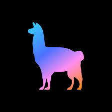

<table>
<tr>
<td valign="top" width="50%">
Currently Exploring
  
- Distributed training pipelines for large-scale ML models

- Low-latency data processing + real-time inference systems

- Retrieval-augmented generation + agentic workflows

- Building production ML APIs and end-to-end intelligent apps

</td>
</tr>
</table>

---

### Tech Stack that I am exploring✨ 

<table> <tr> <td align="center" width="96"> Python</td> <td align="center" width="96"> C/C++</td> <td align="center" width="96"> Java</td> <td align="center" width="96"> TypeScript</td> <td align="center" width="96"> React</td> <td align="center" width="96"> Node.js</td> <td align="center" width="96"> Flask</td> </tr> <tr> <td align="center" width="96"> PyTorch</td> <td align="center" width="96"> TensorFlow</td> <td align="center" width="96"> HuggingFace</td> <td align="center" width="96"> sklearn</td> <td align="center" width="96"> NumPy</td> <td align="center" width="96"> Pandas</td> <td align="center" width="96"> Spark</td> </tr> <tr> <td align="center" width="96"> PostgreSQL</td> <td align="center" width="96"> Neo4j</td> <td align="center" width="96"> Linux</td> <td align="center" width="96"> Docker</td> <td align="center" width="96"> Git</td> <td align="center" width="96"> LangChain</td> <td align="center" width="96"> LlamaIndex</td> </tr> </table>